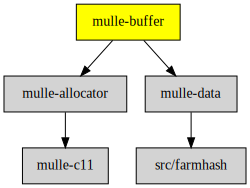

# mulle-buffer

#### ↗️  A growable C char array and also a stream - on stack and heap

mulle-buffer can construct arbitrary long binary data dynamically or in static
storage. You don't have to worry about calculating the necessary buffer size.
It's easy, fast and safe. It can also be used as a stream and it is used to
implement NSMutableData. mulle-buffer has functions to create hexdumps and
quoted C string output.

With [mulle-fprintf](//github.com/mulle-core/mulle_fprintf), you can use
`printf` style formatting and create string concatenations without
having to worry about memory management.


| Release Version                                       | Release Notes  | AI Documentation
|-------------------------------------------------------|----------------|---------------
|  [](//github.com/mulle-c/mulle-buffer/actions)  | [RELEASENOTES](RELEASENOTES.md) | [DeepWiki for mulle-buffer](https://deepwiki.com/mulle-c/mulle-buffer)


## API

| Data Structure                                        | Description
| ------------------------------------------------------| ----------------------------------------
| [`mulle-buffer`](dox/API_BUFFER.md)                   | A resizable alloca buffer that grows to the heaep if needed
| [`mulle-flushablebuffer`](dox/API_FLUSHABLEBUFFER.md) | Useful for dumps and other longer output


## Examples


### Dynamic C string construction

Here a C string is constructed that is valid inside the `mulle_buffer_do`
block:


``` c
void  test( void)
{
   mulle_buffer_do( buffer)
   {
      mulle_buffer_add_string( buffer, "hello");
      mulle_buffer_add_string( buffer, " ");
      mulle_buffer_add_string( buffer, "world");

      printf( "%s\n", mulle_buffer_get_string( buffer));
   }
}
```

As soon as the `mulle_buffer_do` block is exited, the buffer will be invalid.

> #### Note
>
> A `break` outside of the block is OK and does not leak, but a return will


### Use explicit stack memory for small strings

`mulle_buffer_do` will create a default sized `alloca` ca. 100 bytes.

If you want to specify the amount of stack space yourself, you can use
`mulle_buffer_do_flexible`. If the stack storage is exhausted, the string will be copied
to dynamically allocated memory:


``` c
void  test( void)
{
   char   tmp[ 256];

   mulle_buffer_do_flexible( buffer, tmp)
   {
      mulle_buffer_add_string( buffer, "hello");
      mulle_buffer_add_string( buffer, " ");
      mulle_buffer_add_string( buffer, "world");

      printf( "%s\n", mulle_buffer_get_string( buffer));
   }
}
```


{
   char   tmp[ 8];  // space for seven characters and trailing zero

   mulle_buffer_do_inflexible( buffer, tmp)
   {
      mulle_buffer_add_string( buffer, "VfL_");
      mulle_buffer_add_string( buffer, "Bochum");

      printf( "%s\n", mulle_buffer_get_string( buffer));
   }
}
```


{
   unsigned int   i;
   char           *s;

   mulle_buffer_do_string( buffer, NULL, s)
   {
      for( i = 0; i < 10; i++)
         mulle_buffer_add_byte( buffer, 'a' + i % 26);

      mulle_buffer_memset( buffer, 'z', 10);
      mulle_buffer_add_string( buffer, "hello");
   }

   printf( "%s\n", s);
   mulle_free( s);         // this time its allocated
}
```


You will have to `mulle_free` the constructed string "s".

### Permanent mulle-buffer

If the mulle-buffer should live longer than the current function, create
and destroy a buffer manually:

``` c
buffer = mulle_buffer_create_default();
...
mulle_buffer_destroy( buffer);
```

or

``` c
mulle_buffer_init_default( &buffer);
...
mulle_buffer_done( buffer);
```

> #### Tip
>
> Use the companion project [mulle-sprintf](//github.com/mulle-core/mulle-sprintf) to
> print data with format strings a la `sprintf` into a mulle-buffer.
>


### You are here




## Quickstart

Install [mulle-core developer](https://github.com/MulleFoundation/foundation-developer?tab=readme-ov-file#install)
then:


``` sh
mulle-sde init -d my-project -m mulle-core/c-developer executable
cd my-project
mulle-sde vibecoding on
mulle-sde run
```

You are done, skip the following "Add" step.


## Add

**This project is a component of the [mulle-core](//github.com/mulle-core/mulle-core) library.
As such you usually will *not* add or install it individually, unless you
specifically do not want to link against `mulle-core`.**


### Add as an individual component

Use [mulle-sde](//github.com/mulle-sde) to add mulle-buffer to your project:

``` sh
mulle-sde add github:mulle-c/mulle-buffer
```

To only add the sources of mulle-buffer with dependency
sources use [clib](https://github.com/clibs/clib):


``` sh
clib install --out src/mulle-c mulle-c/mulle-buffer
```

Add `-isystem src/mulle-c` to your `CFLAGS` and compile all the sources that were downloaded with your project.


## Install

Use [mulle-sde](//github.com/mulle-sde) to build and install mulle-buffer and all dependencies:

``` sh
mulle-sde install --prefix /usr/local \
   https://github.com/mulle-c/mulle-buffer/archive/latest.tar.gz
```

### Legacy Installation

Install the requirements:

| Requirements                                 | Description
|----------------------------------------------|-----------------------
| [mulle-allocator](https://github.com/mulle-c/mulle-allocator)             | 🔄 Flexible C memory allocation scheme
| [mulle-data](https://github.com/mulle-c/mulle-data)             | #️⃣ A collection of hash functions

Download the latest [tar](https://github.com/mulle-c/mulle-buffer/archive/refs/tags/latest.tar.gz) or [zip](https://github.com/mulle-c/mulle-buffer/archive/refs/tags/latest.zip) archive and unpack it.

Install **mulle-buffer** into `/usr/local` with [cmake](https://cmake.org):

``` sh
PREFIX_DIR="/usr/local"
cmake -B build                               \
      -DMULLE_SDK_PATH="${PREFIX_DIR}"       \
      -DCMAKE_INSTALL_PREFIX="${PREFIX_DIR}" \
      -DCMAKE_PREFIX_PATH="${PREFIX_DIR}"    \
      -DCMAKE_BUILD_TYPE=Release &&
cmake --build build --config Release &&
cmake --install build --config Release
```


## Author

[Nat!](https://mulle-kybernetik.com/weblog) for Mulle kybernetiK  


