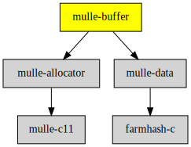

# mulle-buffer

#### ↗️ A growable C char array and also a stream

mulle-buffer can construct arbitrary long binary data dynamically or in static
storage. You don't have to worry about calculating the necessary buffer size.
It's easy, fast and safe. It can also be used as a stream and it is used to
implement NSMutableData.


| Release Version                                       | Release Notes
|-------------------------------------------------------|--------------
|  [](//github.com/mulle-c/mulle-buffer/actions)  | [RELEASENOTES](RELEASENOTES.md) |


## API

| Data Structure                               | Description
| ---------------------------------------------| ----------------------------------------
| [`mulle-buffer`](dox/API_BUFFER.md)          | A resizable byte buffer that can grow dynamically as needed
| [`mulle-flexbuffer`](dox/API_FLEXBUFFER.md)  | A portable replacement for [alloca](https://www.man7.org/linux/man-pages/man3/alloca.3.html)


## Examples


### Dynamic C string construction

Here a C string is constructed that is valid inside the `mulle_buffer_do`
block:


``` c
void  test( void)
{
   mulle_buffer_do( buffer)
   {
      mulle_buffer_add_string( buffer, "hello");
      mulle_buffer_add_string( buffer, " ");
      mulle_buffer_add_string( buffer, "world");

      printf( "%s\n", mulle_buffer_get_string( buffer));
   }
}
```

As soon as the `mulle_buffer_do` block is exited, the buffer will be invalid.

> #### Note
>
> A `break` outside of the block is OK and does not leak, but a return will


### Use the stack for small strings

If you expect the string to be small in most circumstances, you can use
`mulle_buffer_do_flexible` to keep character storage on the stack as long
as possible. If the stack storage is exhausted, the string will be copied
to dynamically allocated memory:


``` c
void  test( void)
{
   char   tmp[ 256];

   mulle_buffer_do_flexible( buffer, tmp)
   {
      mulle_buffer_add_string( buffer, "hello");
      mulle_buffer_add_string( buffer, " ");
      mulle_buffer_add_string( buffer, "world");

      printf( "%s\n", mulle_buffer_get_string( buffer));
   }
}
```

If you don't want the string to ever exceed the initial storage length
you can use `mulle_buffer_do_inflexible`:

``` c
void  test( void)
{
   char   tmp[ 4];

   mulle_buffer_do_inflexible( buffer, tmp)
   {
      mulle_buffer_add_string( buffer, "hello");

      printf( "%s\n", mulle_buffer_get_string( buffer));
   }
}
```

This should print "hel", as a trailing zero will be needed for the last
character.


### Convenience macro for creating allocated strings

To construct a dynamically allocated string, that you can use outside of the
`mulle_buffer_do` block, use the `mulle_buffer_do_string` convenience macro.
It's similar to `mulle_buffer_do`, but takes two more arguments.
The second argument is the allocator to use for
the string. Use NULL for the default allocator or use `&mulle_stdlib_allocator`
for the standard C allocator. The third parameter is the `char *` variable name
that will hold the resultant C string:


``` c
void  test( void)
{
   unsigned int   i;
   char           *s;

   mulle_buffer_do_string( buffer, NULL, s)
   {
      for( i = 0; i < 10; i++)
         mulle_buffer_add_byte( buffer, 'a' + i % 26);

      mulle_buffer_memset( buffer, 'z', 10);
      mulle_buffer_add_string( buffer, "hello");
   }

   printf( "%s\n", s);
   mulle_free( s);         // this time its allocated
}
```

You will have to `mulle_free` the constructed string "s".


> #### Tip
>
> Use the companion project [mulle-sprintf](//github.com/mulle-core/mulle-sprintf) to
> print data with format strings a la `sprintf` into a mulle-buffer.
>


### flexbuffer, a replacement for alloca

The `mulle_flexbuffer` can be used as an replacement for `alloca`. The problem
with `alloca` is always two-fold. 1.) It's non-standard and not available on
all platforms. 2.) The amount of memory to `alloca` may exceed the available
stack space. The `mulle_flexbuffer` solves this problem by using a small amount
of stack space for low memory scenarios and moving to `malloc`, when it's
needed.

Example:

``` c
 void  foo( char *s)
{
   size_t   n;

   n = strlen( s) + 1;
   mulle_flexbuffer_do( copy, 32, n)
   {
      strcpy( copy, s); // guaranteed to not overflow
   }
}
```

A `char *` named "copy" is created. "copy" either points to stack memory or to
a malloced area. `mulle_flexbuffer_do` defines the maximum amout of memory
to be stored on the stack. In this case its `char[ 32]`. The actual amount
used is determined by `n`. The flexbuffer will be valid in the scope of the
`mulle_flexbuffer_do` block statement only.


### You are here




## Add

**This project is a component of the [mulle-core](//github.com/mulle-core/mulle-core) library. As such you usually will *not* add or install it
individually, unless you specifically do not want to link against
`mulle-core`.**


### Add as an individual component

Use [mulle-sde](//github.com/mulle-sde) to add mulle-buffer to your project:

``` sh
mulle-sde add github:mulle-c/mulle-buffer
```

To only add the sources of mulle-buffer with dependency
sources use [clib](https://github.com/clibs/clib):


``` sh
clib install --out src/mulle-c mulle-c/mulle-buffer
```

Add `-isystem src/mulle-c` to your `CFLAGS` and compile all the sources that were downloaded with your project.


## Install

### Install with mulle-sde

Use [mulle-sde](//github.com/mulle-sde) to build and install mulle-buffer and all dependencies:

``` sh
mulle-sde install --prefix /usr/local \
   https://github.com/mulle-c/mulle-buffer/archive/latest.tar.gz
```

### Manual Installation

Install the requirements:

| Requirements                                 | Description
|----------------------------------------------|-----------------------
| [mulle-allocator](https://github.com/mulle-c/mulle-allocator)             | 🔄 Flexible C memory allocation scheme
| [mulle-data](https://github.com/mulle-c/mulle-data)             | #️⃣ A collection of hash functions

Download the latest [tar](https://github.com/mulle-c/mulle-buffer/archive/refs/tags/latest.tar.gz) or [zip](https://github.com/mulle-c/mulle-buffer/archive/refs/tags/latest.zip) archive and unpack it.

Install **mulle-buffer** into `/usr/local` with [cmake](https://cmake.org):

``` sh
cmake -B build \
      -DCMAKE_INSTALL_PREFIX=/usr/local \
      -DCMAKE_PREFIX_PATH=/usr/local \
      -DCMAKE_BUILD_TYPE=Release &&
cmake --build build --config Release &&
cmake --install build --config Release
```


## Author

[Nat!](https://mulle-kybernetik.com/weblog) for Mulle kybernetiK


