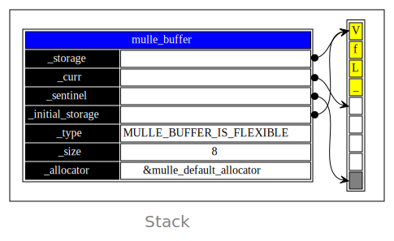
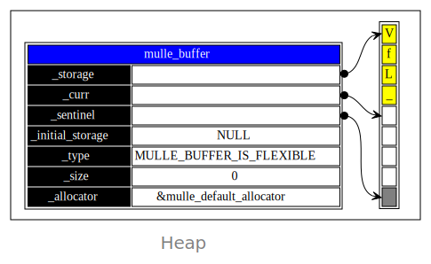
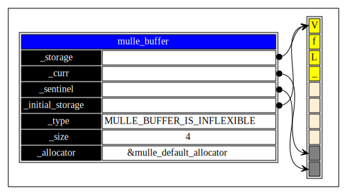

# `mulle_buffer`

`mulle_buffer` is a multi-purpose **`unsigned char`** array. It can be
useful as a stream, as a string buffer and to parse simple things. It's
interface is quite complex.

It has a companion container called `mulle_flushablebuffer`. This a non
growing array, that will flush its contents to a callback when it is full.
This is useful for acting like a "write" stream.

## Buffer Modes and States

| Term            | Description
|.----------------|-----------------------------
| `inflexable`    | a buffer that does not grow
| `static`        | the initial storage is on the stack or in .bss / .data segment
| `flushable`     | buffer contents can be "flushed" out to a consumer, freeing it up to hold more contents. This goes hand in hand | with being inflexable.
| `overflown`     | the inflexable buffer had to truncate content, or a buffer read couldn't be done


## Examples

Use `mulle_buffer_do` to create an output string:

``` c
#include <mulle-buffer/mulle-buffer.h>

#include <stdio.h>

void  foo( void)
{
   mulle_buffer_do( buffer)
   {
      unsigned int   i;

      for( i = 0; i < 10; i++)
         mulle_buffer_add_byte( &buffer, 'a' + i % 26);

      mulle_buffer_memset( &buffer, 'z', 10);
      mulle_buffer_add_string( &buffer, "hello");

      printf( "%s\n", mulle_buffer_get_string( &buffer));
   }
}
```

This is the most convenient. The contents will be kept on the stack
until a certain maximum size is exceeded. 



Then the string is copied to heap memory, and operations continue. Everything 
is cleaned up, when the `mulle_buffer_do` block ends. You don't have to worry 
about proper termination  with a zero byte.


### `mulle_buffer` as a dynamic array creator



``` c
struct mulle_buffer   *buf;
char                  *s;

buf = mulle_buffer_create_default();
mulle_buffer_add_string( buf, "VfL");
mulle_buffer_add_char( buf, 0);
s = mulle_buffer_extract_string( buf);
mulle_buffer_destroy( buf);

printf( "%s\n", s);
mulle_free( s);
```

### `mulle_buffer` as overflow protection

Initialize a stack array. `mulle_buffer` ensures that no data is written out
of bounds:

``` c
{
   struct mulle_buffer   buffer;
   auto                  string[ 64];

   mulle_buffer_init_inflexable_with_static_bytes( &buffer, string, sizeof( string));

   // operations on &buffer can not overflow `string` now
   for( i = 0; i < 100; i++)
      mulle_buffer_add( &buffer, i);
   mulle_buffer_done( &buffer);
}
```

In an overflow situation, the buffer will be incomplete. In the next example
someone advanced the `_curr` past the `_sentinel`. It will stick there and will
mark the buffer as overflown:



Notice how the length of the pre-overflow buffer is kept.


### `mulle_buffer` as a string stream reader

Read characters with an offset from a string:

``` c
{
   struct mulle_buffer   buffer;
   static char           string[] = "VfL Bochum 1848\n";

   mulle_buffer_init_inflexable_with_static_bytes( &buffer, string, sizeof( string));

   mulle_buffer_set_seek( &buffer, SEEK_SET, 4);
   while( c == mulle_buffer_get_char( &buffer))
      putchar( c);
   mulle_buffer_done( &buffer);
}
```


### Convenience macros

The convenience macro `mulle_buffer_do` saves you from typing the
variable declaration and the `_init` and `_done` calls. The scope of the
`mulle_buffer` is restricted to the blockquote following the `mulle_buffer_do`.
Also note that, though the actual "mulle_buffer" is stack based, within the
"do" scope, you are accessing the "mulle_buffer" with a pointer, to save a
bit more type work:


``` c
// ...

void  test( void)
{
   // ...

   mulle_buffer_do( buffer)
   {
      // ...
      mulle_buffer_add_string( buffer, "hello");

      printf( "%s\n", mulle_buffer_get_string( buffer));
   }
}
```

You can use `break` inside the `mulle_buffer_do` block to leave it. If you use
`return`, you will risk a memory leak. Use `mulle_buffer_return` instead. Or
explicitly delete the buffer with `mulle_buffer_done` before issuing `return`.


### Convenience macros for small strings with truncation

If you don't want the produced string to ever exceed the initial storage length
you can use `mulle_buffer_do_inflexible`

``` c
void  test( void)
{
   char   tmp[ 4];

   mulle_buffer_do_inflexible( buffer, tmp)
   {
      mulle_buffer_add_string( buffer, "hello");

      printf( "%s\n", mulle_buffer_get_string( buffer));
   }
}
```

This should print "hel", as a trailing zero will be needed for the last
character.


### Convenience macro for creating allocated strings

To construct a dynamically allocated string, you can use the
`mulle_buffer_do_string` convenience macro. It's similar to `mulle_buffer_do`,
but takes two more arguments. The second argument is the allocator to use for
the string. Use NULL for the default allocator or `&mulle_stdlib_allocator` for
the standard C allocator. The third parameter is the `char *`  variable name
that will hold the resultant C string:


``` c
void  test( void)
{
   unsigned int   i;
   char           *s;

   mulle_buffer_do_string( buffer, NULL, s)
   {
      for( i = 0; i < 10; i++)
         mulle_buffer_add_byte( buffer, 'a' + i % 26);

      mulle_buffer_memset( buffer, 'z', 10);
      mulle_buffer_add_string( buffer, "hello");
   }

   printf( "%s\n", s);
   mulle_free( s);         // this time its allocated
}
```

You will have to `mulle_free` the constructed string "s".


> #### Tip
>
> Use the companion project [mulle-sprintf](//github.com/mulle-core/mulle-sprintf) to
> print data with format strings a la `sprintf` into a mulle-buffer.
>


### Dynamic File reader

Read a file into a malloced memory buffer. The buffer is efficiently
grown as to minimize reallocs. The returned buffer is sized to fit.
The intermediate `mulle_buffer` is removed.


``` c
struct mulle_data    read_file( FILE *fp)
{
   struct mulle_buffer   buffer;
   struct mulle_data     data;
   void                  *ptr;
   size_t                length;
   size_t                size;

   mulle_buffer_init( &buffer, NULL)
   while( ! feof( fp))
   {
      ptr  = mulle_buffer_guarantee( &buffer, 0x1000);
      assert( ptr);  // can't be NULL as we are not a limited buffer
      size = mulle_buffer_guaranteed_size( &buffer);
      assert( size >= 0x1000);   // could also be larger, use it
      length = fread( ptr, 1, size, fp);

      mulle_buffer_advance( &buffer, length);
   }
   mulle_buffer_shrink_to_fit( &buffer);

   data = mulle_buffer_extract_data( &buffer);
   mulle_buffer_done( &buffer);

   return( data);
}
```


### Output stream to file handle


``` c
void  dump( FILE *fp, void *bytes, size_t length)
{
   struct mulle_flushablebuffer   flushable_buffer;
   struct mulle_buffer            *buffer;
   char                           storage[ 1024];  // storage for buffer

   mulle_flushablebuffer_init( &flushable_buffer,
                               storage,
                               sizeof( storage),
                               (mulle_flushablebuffer_flusher_t) fwrite,
                               fp);
   {
      buffer = mulle_flushablebuffer_as_buffer( &flushable_buffer);
      mulle_buffer_add_string( buffer, "---\n");
      mulle_buffer_hexdump( buffer, bytes, length, 0, mulle_buffer_hexdump_default);
      mulle_buffer_add_string( buffer, "---\n");
   }
   mulle_flushablebuffer_done( &flushable_buffer);
}
```

